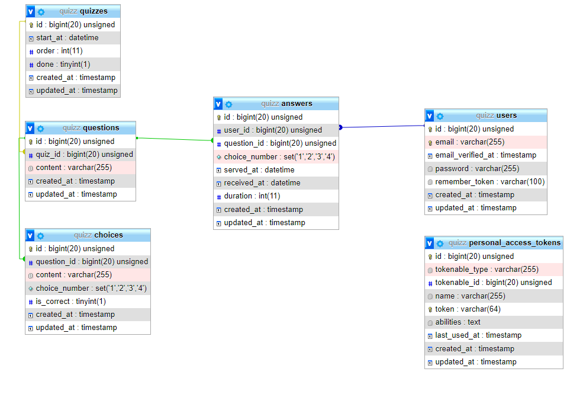

# Quiz Ramadan El-Hayat School

This is a project is made with **Laravel** and **React**.

-   **Laravel** for APIs and managements pages.
-   **React** mostly for JSX (no hooks).

## DB



## Up and Running

```terminal
composer install
```

```terminal
npm install
```

```terminal
composer dump
```

```terminal
php artisan key:generate
```

```terminal
php artisan optimize:clear
```

```terminal
php artisan migrate:fresh --seed
```

```terminal
npm run dev
```

## Weak Auth

[Documentation](app/Http/Middleware/WeakAuth.md)
