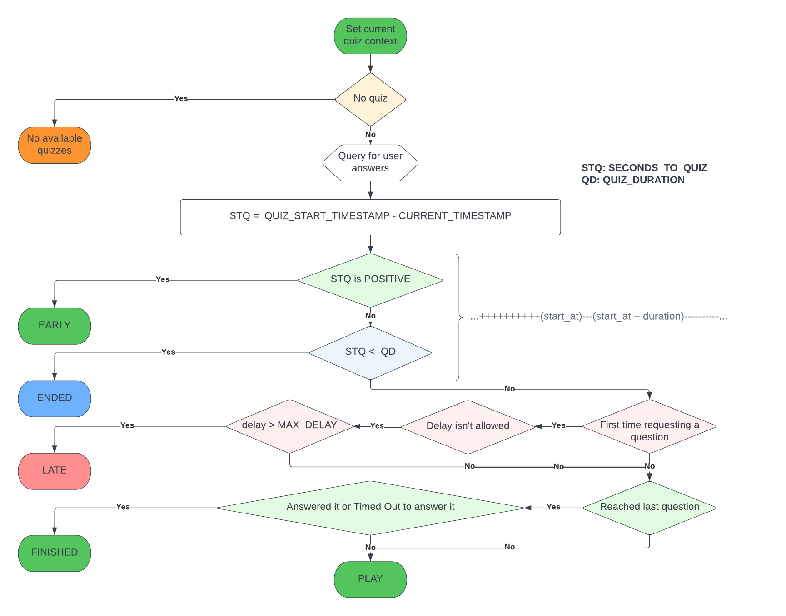

# Quiz Ramadan El-Hayat School

This a live quiz game Laravel project, It is made to host multiple quizzes with specified dates where each quiz has 4 questions and each question may have 3 or 4 choices.

The code was optimized to handle a huge amount of players at the same time.

## DB


## Logic



## Up and Running

```terminal
git clone https://github.com/elaborate-code/quiz
```

```terminal
cd quiz
```

Set the database and edit the `.env` file

```terminal
composer install
```

```terminal
npm install
```

```terminal
php artisan key:generate
```

```terminal
php artisan optimize:clear
```

```terminal
php artisan migrate:fresh --seed
```

```terminal
npm run dev
```

## TODO

-   Test quiz index.
-   Test ranking.
-   Test quiz remaining time less than question.
-   Enhance the reponsivity.
-   Nav bar.
-   Hamburger menu.
-   Show ended quiz answers.
-   Show all quizzes ranking.

## Timeline moments

At the beggining we tried to implement this project with **APIs** and **ReactJS** Until https://github.com/elaborate-code/quiz/commit/cd1ef1017bab5f3fed403d90effdc77e8c2bd543
but we faced an issue with the JS `setInterval` and **React**'s rendering loops. So we abondonned that approache fearing to not respect the deadlines while trying to solve the challenge.

Also before implementing the admin role, we implemented a middlware named **Weak Auth** https://github.com/elaborate-code/quiz/commit/109089b5956bd18bd55a583cc6054c42084607c7 ([docs](app/Http/Middleware/WeakAuth.md))

Testing started at https://github.com/elaborate-code/quiz/commit/d241f9e62c508b1e1729e96e4e3ffe1b5522f333
